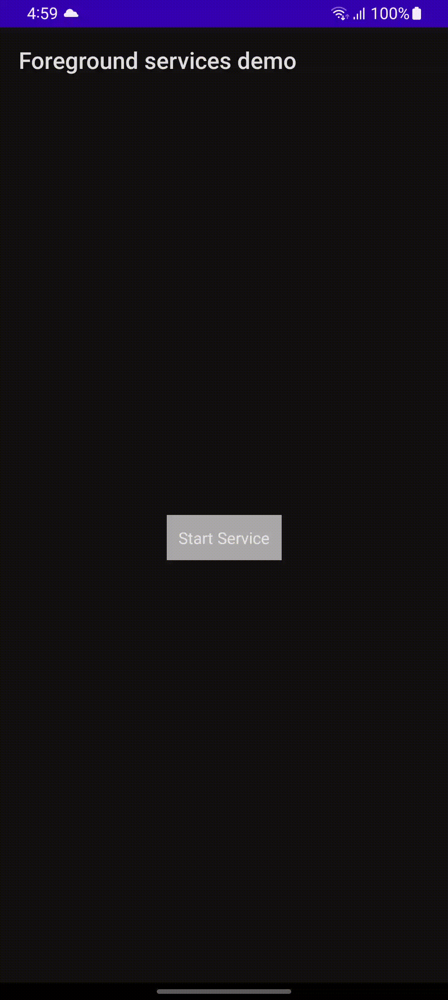

# Android - Foreground Service Demo

A Android based Foreground Service Demo. 

## Table of contents
- [Android Support](#android-support)
- [Demo](#demo)
- [Features](#features)
- [Getting started](#getting-started)
- [Usage](#usage)
- [Methods](#methods)
- [Want to Contribute?](#want-to-contribute)
- [Need Help / Support?](#need-help)
- [Collection of Components](#collection-of-Components)
- [Changelog](#changelog)
- [License](#license)
- [Keywords](#Keywords)

## Android Support

Version - Android 14

We have tested our program in above version, however you can use it in other versions as well.

## Demo

## Features

* Android foreground service integration.
* Continues location tracking in each minute

## Getting started

* Download this sample project and import classes in your Android App. 
* Store location data as per your requirements. 

## Usage

Setup process is described below to integrate in sample project.

### Methods

Gradle Dependencies for location
      
    implementation 'com.google.android.gms:play-services-location:21.0.1'
    
Intent for foreground service

    val mServiceIntent = Intent(this, mLocationService.javaClass)

Start service with below code
    
    startService(mServiceIntent)

Further implementation you can do as per requirement and usage.

## Want to Contribute?

- Created something awesome, made this code better, added some functionality, or whatever (this is the hardest part).
- [Fork it](http://help.github.com/forking/).
- Create new branch to contribute your changes.
- Commit all your changes to your branch.
- Submit a [pull request](http://help.github.com/pull-requests/).

 
## Collection of Components
 We have built many other components and free resources for software development in various programming languages. Kindly click here to view our [Free Resources for Software Development.](https://www.weblineindia.com/software-development-resources.html)

## Changelog
Detailed changes for each release are documented in [CHANGELOG](./CHANGELOG).

## License
[MIT](LICENSE)

[mit]: ./LICENSE

## Keywords
Android foreground service, Foreground Service, Service, Background Service, Background Task
